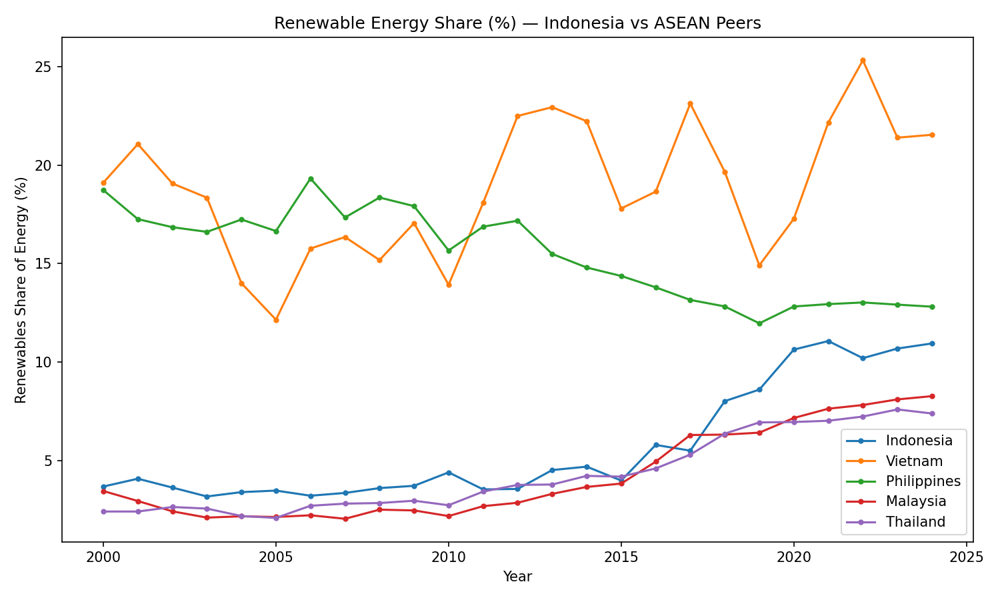
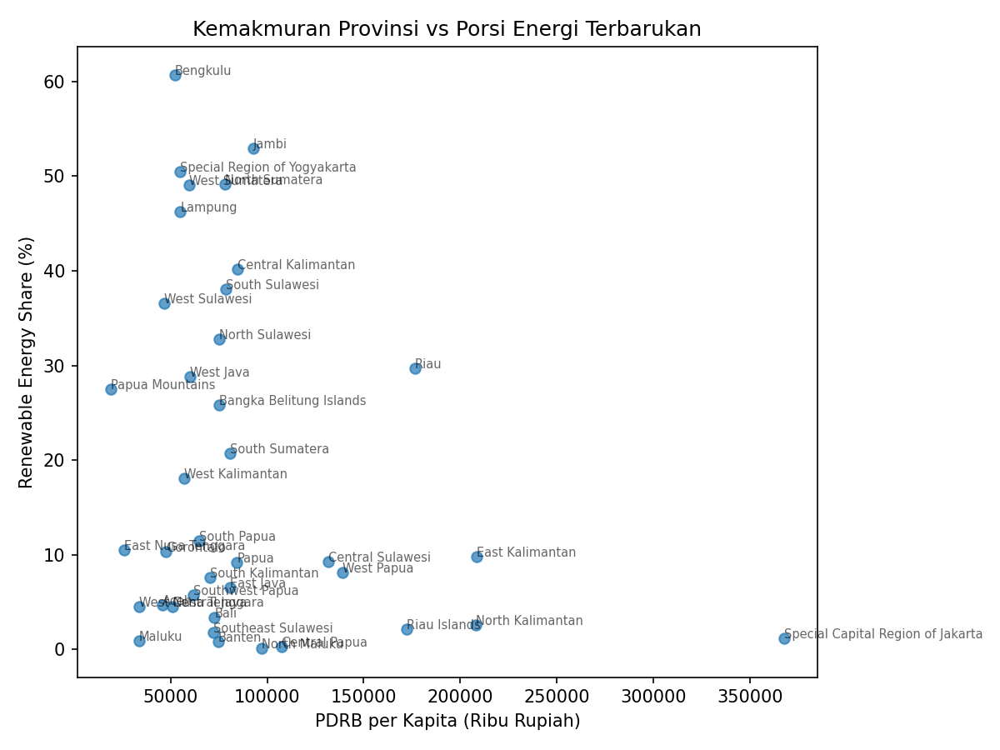

# Potensi Energi Baru Terbarukan per Provinsi di Indonesia

Analisis kualitas data dan integrasi multi-sumber untuk memetakan potensi pengembangan energi geothermal di Indonesia — menggabungkan data konteks global (OWID), kapasitas pembangkit, cadangan geothermal & batubara (ESDM), dan PDRB (BPS) ke dalam satu dataset provinsi yang tervalidasi.

## Latar Belakang & Tujuan

Proyek ini menjawab dua pertanyaan:

1. **Secara global**, bagaimana posisi Indonesia dalam adopsi energi terbarukan dibanding negara tetangga ASEAN?
2. **Secara domestik**, provinsi mana yang punya peluang riil untuk pengembangan energi geothermal — bukan sekadar provinsi terkaya atau terbesar, tapi yang benar-benar punya potensi fisik yang belum dimanfaatkan?

Proyek ini sekaligus jadi showcase dua kemampuan: **(1) data quality & integration** dari sumber yang tidak seragam — termasuk data yang diekstrak manual dari dokumen PDF resmi pemerintah — dan **(2) analisis statistik yang jujur soal batasannya**, bukan sekadar dashboard yang terlihat rapi.

## Sumber Data

| Sumber | Cakupan | Format Asli | Catatan |
|---|---|---|---|
| [Our World in Data — Energy](https://github.com/owid/energy-data) | Global, per negara-tahun | CSV/XLSX, open access (CC BY) | Dipakai untuk konteks pembuka (Bagian 0), bukan untuk merge tingkat provinsi |
| Kementerian ESDM — [Handbook of Energy & Economic Statistics of Indonesia 2025](https://www.esdm.go.id/assets/media/content/content-handbook-of-energy-and-economic-statistics-of-indonesia-2025.pdf) | Kapasitas pembangkit per provinsi | PDF resmi, diekstrak manual ke CSV/Excel | Digunakan untuk kapasitas pembangkit, cadangan geothermal, dan cadangan batubara |
| [BPS — PDRB per Kapita per Provinsi](https://galura.jabarprov.go.id/dataset/produk-domestik-regional-bruto-pdrb-per-kapita--atas-dasar-harga-berlaku-berdasarkan-provinsi-di-indonesia) | PDRB per kapita per provinsi per tahun | API publik, GALURA DATA JABAR diekstrak dari BPS | Data terbaru (tahun 2016 - 2025) yang dipakai untuk merge |

**Catatan metodologi penting:** karena data ESDM dan BPS diekstrak manual dari dokumen PDF (bukan API atau dataset terbuka siap-pakai), seluruh angka hasil ekstraksi divalidasi silang terhadap total resmi yang dipublikasikan di Handbook ESDM 2025 (lihat bagian Validasi di bawah) untuk memastikan tidak ada kesalahan transkripsi material.

## Dua Jalur Analisis: Excel vs Python

Proyek ini sengaja dikerjakan lewat dua jalur berbeda, bukan sebagai duplikasi tapi karena masing-masing cocok untuk tujuan yang berbeda:

- **Jalur Excel** (`Cleaned_Renewable_Energy_Potential_per_Province_.xlsx`) — audit-trail manual yang transparan langkah demi langkah (raw sheets → PivotTable PDRB → merge final), mudah dibaca stakeholder non-teknis, cocok untuk quick join dan pivot sederhana.
- **Jalur Python/Colab** (`Potensi_EBT_per_Provinsi_di_Indonesia.ipynb`) — reproducible, dan melangkah lebih jauh ke analisis yang tidak praktis dilakukan manual: validasi otomatis terhadap sumber resmi, uji statistik, dan pemodelan skor multi-variabel.

**Disclosure cakupan:** kedua jalur ini **tidak 1:1**. Jalur Excel (sheet `Final Results`) berhenti di penggabungan PDRB + kapasitas pembangkit. Jalur Python melangkah lebih jauh: menambahkan cadangan geothermal & batubara, gap analysis, uji korelasi, dan opportunity index. Kedua jalur saling melengkapi: Excel unggul untuk join & pivot cepat yang mudah diaudit orang non-teknis, Python unggul untuk analisis multi-sumber yang lebih dalam.

## Bagian 0 — Konteks Global (OWID)

Sebelum masuk ke level provinsi, posisi Indonesia dibandingkan dengan 4 negara ASEAN (Vietnam, Filipina, Malaysia, Thailand) untuk `renewables_share_energy`, 2000–2024.



**Temuan (data terbaru, 2024):**

| Negara | Renewables Share of Energy |
|---|---|
| Vietnam | 21.53% |
| Filipina | 12.82% |
| **Indonesia** | **10.95%** |
| Malaysia | 8.28% |
| Thailand | 7.40% |

Indonesia berada di **posisi ke-3 dari 5** negara yang dibandingkan — bukan yang tertinggal, tapi juga bukan yang memimpin di kawasan. Ini membuka pertanyaan berikutnya: di mana letak ruang untuk berkembang itu secara domestik?

## Data Cleaning & Validasi

Langkah-langkah yang diambil untuk memastikan data bersih dan dapat dipercaya sebelum dianalisis:

- Seluruh nilai `'-'` pada data mentah dikonversi menjadi `0`, dengan **logging eksplisit jumlah nilai yang diganti per kolom** — untuk audit trail, meski pada dataset ini tidak ditemukan nilai yang perlu diganti.
- Nama provinsi (Bahasa Indonesia → Inggris) dipetakan dan diverifikasi otomatis — hasil akhir menunjukkan **nol kegagalan pemetaan** dari 38 provinsi.
- Sebelum melakukan merge antar tabel, dilakukan pengecekan keunikan kunci (`assert ... is_unique`) untuk mencegah data ganda menyusup diam-diam akibat duplikasi baris.
- **Cross-validation terhadap Handbook ESDM 2025**: total hasil perhitungan dibandingkan dengan angka resmi yang dipublikasikan pemerintah.

| Metrik | Hasil Perhitungan | Angka Resmi (ESDM 2025) | Selisih |
|---|---|---|---|
| Kapasitas Pembangkit (MW) | 107,498.89 | 107,498.89 | 0.000% |
| Cadangan Geothermal (MW) | 23,204.00 | 23,203.00 | 0.004% |
| Cadangan Batubara (MT) | 33,250.11 | 33,250.10 | 0.000% |

Sumber: *Handbook of Energy & Economic Statistics of Indonesia*, ESDM, edisi 2025 ([tautan](https://www.esdm.go.id/en/publication/handbook-of-energy-economic-statistics-of-indonesia-heesi)), diakses Agustus 2026.

## Temuan Statistik: Kemakmuran vs Porsi Energi Terbarukan

Uji korelasi Pearson antara `pdrb_per_kapita` dan `renewable_share_pct` per provinsi:

**r = -0.252, p = 0.128 → tidak signifikan secara statistik** (ambang p < 0.05).



Ini ditulis apa adanya, bukan dipaksakan jadi cerita yang "kedengaran menarik". Kesimpulan yang jujur: **tidak ditemukan hubungan yang signifikan antara kemakmuran ekonomi provinsi dan porsi energi terbarukannya** — mengindikasikan bahwa adopsi EBT di tingkat provinsi lebih dipengaruhi oleh ketersediaan sumber daya alam (geografi) daripada kapasitas ekonomi daerah. Hasil "tidak signifikan" ini sendiri adalah insight yang berguna: ia membantah asumsi naif bahwa "provinsi kaya otomatis lebih hijau".

## Geothermal Investment Opportunity Index

**Catatan cakupan:** index ini secara khusus mengukur peluang **geothermal**, bukan energi terbarukan secara umum — dataset yang tersedia tidak memiliki data potensi/reserve untuk solar maupun angin yang setara granularitasnya, sehingga index ini tidak dapat diklaim mencakup EBT secara menyeluruh.

**Eligibility filter:** provinsi dengan `geothermal_untapped_mw = 0` dikeluarkan dari ranking, karena secara definisi tidak memiliki peluang geothermal untuk dinilai — terlepas dari seberapa tinggi PDRB-nya. Enam provinsi dikecualikan dengan alasan ini, termasuk **Daerah Khusus Ibu Kota Jakarta**, yang memiliki PDRB per kapita tertinggi secara nasional namun secara geografis tidak memiliki sumber daya geothermal untuk dikembangkan.

**Formula skoring (gating, bukan aditif):** peluang geothermal (`geothermal_untapped_mw`, ternormalisasi) menjadi faktor utama secara multiplikatif, sementara PDRB dan cadangan batubara hanya berfungsi sebagai *modifier* yang menaikkan atau menurunkan skor — tidak dapat menciptakan skor tinggi dari potensi geothermal yang nyaris nol. Pendekatan ini diambil setelah versi awal (aditif) ditemukan meloloskan provinsi dengan potensi geothermal sangat kecil ke posisi atas semata-mata karena PDRB tinggi.

**Top 10 provinsi:**

| Provinsi | Geothermal Untapped (MW) | Cadangan Batubara (MT) | PDRB per Kapita | Skor |
|---|---|---|---|---|
| West Java | 3,159.32 | 0.00 | 59,864.61 | 1.056 |
| West Sumatera | 1,558.75 | 26.04 | 59,548.83 | 0.519 |
| Lampung | 1,503.00 | 56.00 | 55,009.07 | 0.497 |
| East Java | 1,265.00 | 0.00 | 80,855.92 | 0.435 |
| Central Java | 1,268.20 | 0.00 | 50,823.64 | 0.417 |
| North Sumatera | 1,155.46 | 7.12 | 78,310.29 | 0.396 |
| South Sumatera | 1,236.67 | 7,804.87 | 80,663.49 | 0.386 |
| East Nusa Tenggara | 1,170.92 | 0.00 | 25,837.48 | 0.369 |
| Aceh | 1,031.00 | 507.05 | 45,770.40 | 0.333 |
| North Sulawesi | 815.28 | 0.00 | 75,234.91 | 0.277 |

Menariknya, **South Sumatera** tetap masuk 10 besar meski memiliki cadangan batubara yang jauh lebih tinggi dari provinsi lain (7,804.87 MT, berfungsi sebagai penalti) — ini menunjukkan formula bekerja sebagaimana dimaksud: legacy risk batubara menekan skor, tapi tidak menghapusnya sepenuhnya ketika potensi geothermal-nya juga besar.

## Rekomendasi

Berdasarkan Geothermal Investment Opportunity Index, tiga provinsi berikut menjadi kandidat prioritas untuk pengembangan lebih lanjut:

1. **West Java** — potensi untapped terbesar secara absolut (3,159 MW), tanpa cadangan batubara sebagai legacy risk.
2. **West Sumatera** — potensi besar dengan PDRB yang mendukung kesiapan infrastruktur.
3. **Lampung** — kombinasi serupa dengan cadangan batubara yang masih relatif kecil.

## Struktur Repo

```
├── README.md
├── Potensi_EBT_per_Provinsi_di_Indonesia.ipynb   # Jalur Python
├── Cleaned_Renewable_Energy_Potential_per_Province_.xlsx   # Jalur Excel
├── cleaned_province_energy_v2.csv                # Output hasil akhir (38 provinsi)
├── owid_asean_trend.png
├── correlation_pdrb_renewable.png
└── requirements.txt
```

## Batasan (Limitations)

- Index geothermal tidak mencakup potensi solar/angin karena keterbatasan granularitas data yang tersedia.
- PDRB per kapita Jakarta merupakan outlier ekstrem (efek "kantor pusat perusahaan tercatat di sini") — sudah ditangani lewat eligibility filter, namun perlu diingat saat menginterpretasikan pola PDRB provinsi lain.
- Bobot pada formula opportunity index (0.3 untuk PDRB, -0.2 untuk cadangan batubara) merupakan asumsi yang dapat diperdebatkan, bukan angka yang diturunkan secara empiris — didokumentasikan secara terbuka di dalam kode agar dapat dikoreksi.
- Data ESDM & BPS bersumber dari ekstraksi manual dokumen PDF resmi; divalidasi silang terhadap total resmi (lihat bagian Validasi), namun potensi kesalahan transkripsi minor tetap ada.

## Cara Menjalankan

```bash
pip install -r requirements.txt
jupyter notebook Potensi_EBT_per_Provinsi_di_Indonesia.ipynb
# Runtime → Restart and run all
```

## Lisensi & Atribusi

Data OWID digunakan di bawah lisensi CC BY. Data ESDM dan BPS merupakan data publik pemerintah Indonesia, diakses melalui publikasi resmi yang dapat diunduh publik.
